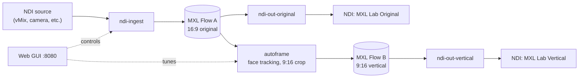

# MXL Lab

A self-contained lab for the [Media eXchange Layer (MXL)](https://github.com/dmf-mxl/mxl). It takes an NDI source, passes it through MXL shared-memory flows, crops it to a 9:16 vertical frame that follows faces, and sends both the original and the vertical picture back out as NDI. A web GUI controls the whole thing.

It runs as Docker containers on a single Ubuntu VM, and one script takes a fresh VM to a working lab.

This is a lab and learning tool, not a production system. See [Security](#security) before putting it on a shared network.

## What it does



Each box is its own container. They share video through MXL flows in `/dev/shm/mxl`, so frames move between them without being copied over the network or re-encoded.

- **ndi-ingest** receives the NDI source and writes it to MXL Flow A.
- **autoframe** reads Flow A, finds faces with the YuNet model in OpenCV, and moves a 9:16 crop window to follow them. The result goes to Flow B. All pixel work stays in GStreamer; Python only moves the crop.
- **ndi-out-original** and **ndi-out-vertical** send Flow A and Flow B out as NDI.
- **gui** is a web page for choosing the source, tuning the framing and watching the pipeline.
- **ndi-discovery** is an optional NDI Discovery Server, for networks that don't use mDNS.

## The web GUI

Open `http://<vm-ip>:8080` once the lab is running.

- **Framing** shows a live preview with the crop window drawn over it. Pick a framing mode (follow the group, follow the nearest face, manual, or hold) and tune how the frame moves: follow speed, speed limit, deadband, return to centre, detection confidence and more. Changes apply within half a second without a restart. In manual mode, drag the window on the preview.
- **NDI source** lists the NDI sources on the network. Pick one, or type a name or an `ip:port` address to connect directly. The source format is read from the source itself by default. Apply and restart starts the four functions in the right order with a clean MXL domain.
- **NDI discovery** switches between mDNS, a discovery server on the VM, and an external discovery server you already run.
- **MXL flows** shows the grain rate of each flow, which should match the source frame rate.
- **Functions** shows each container's state, with restart buttons and logs.

## Requirements

- An x86_64 VM (or machine) running **Ubuntu Server 24.04 or 26.04**.
- A CPU with **AVX2**. In Proxmox, set the VM's CPU type to `host`.
- **8 cores, 16 GB RAM** recommended, with memory ballooning off.
- About **30 GB free disk** for the image build.
- The VM on the **same network or VLAN as your NDI sources**.
- Internet access during setup, to download the NDI SDK and build dependencies.

You will be asked to accept the NDI SDK licence during setup. The NDI SDK is not part of this repository.

## Quick start with the install script

```bash
sudo apt-get install -y git tmux
git clone https://github.com/mykeman/MXL-Lab.git mxl-lab
cd mxl-lab
tmux new -s setup
./setup.sh
```

Run it as your normal user, not root. It uses `sudo` where it needs to.

The script:

1. Checks the VM: Ubuntu, x86_64, AVX2, RAM and free disk.
2. Installs host packages and starts avahi for mDNS.
3. Opens the NDI ports and the GUI port, if `ufw` is active.
4. Creates `/dev/shm/mxl` and a rule that recreates it at every boot.
5. Installs Docker.
6. Downloads the NDI SDK and runs its installer so you can accept the licence, then copies the NDI runtime and Discovery Server into `ndi/`.
7. Creates `.env` and offers a list of the NDI sources it can see.
8. Builds the images. The first build takes **30 to 60 minutes**.
9. Starts the lab and checks the GUI, the GStreamer plugins and the first MXL flow.

It is safe to run again. Completed steps are skipped, and the Docker build cache means a rerun after a failure picks up close to where it stopped. Everything is logged to `setup.log`.

The build is long, which is why the commands above use `tmux`: if your SSH session drops, the build keeps running. Reconnect with `tmux attach -t setup`.

| Option | Effect |
|---|---|
| `--source "NAME"` | Set the NDI source without the prompt |
| `--accept-ndi-eula` | Accept the NDI licence without showing it |
| `--skip-build` | Do the host preparation only, stop before the build |

When it finishes, it prints the GUI address.

## Manual install

These are the same steps the script runs, for anyone who wants to see or control each one. Run them from the cloned `mxl-lab` folder.

### 1. Prepare the host

```bash
sudo apt-get update
sudo apt-get install -y ca-certificates curl wget tar unzip python3 avahi-daemon avahi-utils
sudo systemctl enable --now avahi-daemon

# MXL domain, recreated at every boot
echo "d /dev/shm/mxl 0777 root root -" | sudo tee /etc/tmpfiles.d/mxl.conf
sudo systemd-tmpfiles --create /etc/tmpfiles.d/mxl.conf
```

If `ufw` is active, open NDI and the GUI:

```bash
for rule in 5353/udp 5959:5969/tcp 5959:5969/udp 6960:6970/tcp 6960:6970/udp \
            7960:7970/tcp 7960:7970/udp 8080/tcp; do
  sudo ufw allow "$rule"
done
```

### 2. Install Docker

```bash
curl -fsSL https://get.docker.com | sudo sh
sudo usermod -aG docker "$USER"
```

Log out and back in so `docker` works without `sudo`. If `get.docker.com` does not support your Ubuntu release yet, `sudo apt-get install -y docker.io docker-compose-v2` works too.

### 3. Get the NDI runtime

```bash
mkdir -p ~/src/ndi-sdk && cd ~/src/ndi-sdk
wget https://downloads.ndi.tv/SDK/NDI_SDK_Linux/Install_NDI_SDK_v6_Linux.tar.gz
tar -xzf Install_NDI_SDK_v6_Linux.tar.gz
PAGER=cat ./Install_NDI_SDK_v6_Linux.sh      # read and accept the licence
cd -

mkdir -p ndi
cp -L "$(find ~/src/ndi-sdk -name 'libndi.so.6*' -path '*x86_64-linux-gnu*' | sort | head -1)" ndi/libndi.so.6
cp -L "$(find ~/src/ndi-sdk -type f -iname '*discovery*server*' -path '*x86_64*' | sort | head -1)" ndi/ndi-discovery-server
chmod +x ndi/ndi-discovery-server
```

Use `cp -L`. A symlink in `ndi/` breaks the Docker build.

### 4. Configure

```bash
cp env.example .env
mkdir -p config
chmod +x scripts/*.sh scripts/load-config.py
scripts/ndi-mode.sh mdns --config-only
```

Edit `.env` if you want to set the NDI source now. Otherwise pick it in the GUI later. Set `UBUNTU_VERSION` to your VM's release (for example `26.04`) so the container matches the host.

### 5. Build

```bash
docker compose build ndi-ingest      # the main image, 30 to 60 minutes the first time
docker compose build gui             # a minute or two
```

### 6. Start

```bash
docker compose up -d --no-deps gui ndi-discovery
docker stop mxl-ndi-discovery        # leave it running only if you use the internal discovery server
docker compose create ndi-ingest autoframe ndi-out-original ndi-out-vertical
scripts/lab-apply.sh
```

`lab-apply.sh` starts the four functions in order: ingest first, then waits for Flow A, then the rest. If no source is set in `.env`, it says so. Open the GUI, pick a source and click Apply and restart instead.

Avoid starting all four functions at once with a plain `docker compose up -d`. An output can attach to a flow that is being replaced and sit there with no picture. The GUI and `lab-apply.sh` both avoid this.

## Testing

Work through these in order. Each one checks a layer the next depends on.

**Containers are running**

```bash
docker compose ps
```

All functions should show `running`, not `restarting`.

**The GStreamer plugins load**

```bash
docker compose run --rm --no-deps --entrypoint sh autoframe -c \
  'gst-inspect-1.0 mxlsink >/dev/null && gst-inspect-1.0 ndisrc >/dev/null && echo plugins ok'
```

A warning that `libgstmxl.so` has an unknown licence "Apache-2.0" is harmless.

**NDI sources are visible**

From the host:

```bash
avahi-browse -rt _ndi._tcp
```

From inside a container:

```bash
docker compose exec gui timeout 10 gst-device-monitor-1.0 -f Source/Network:application/x-ndi
```

If the host sees sources and the container doesn't, see [Troubleshooting](#troubleshooting).

**A source can be received**

Replace the address with your sender's IP and port from `avahi-browse`:

```bash
docker compose stop ndi-ingest
docker compose run --rm --no-deps ndi-ingest \
  timeout 15 gst-launch-1.0 -v ndisrc url-address=192.168.1.10:5961 \
  ! ndisrcdemux name=d d.video ! fakesink d.audio ! fakesink
```

Video caps with the source's width and height should print, and it should run the full 15 seconds. Start the lab again afterwards with `scripts/lab-apply.sh`.

**The MXL flows are moving**

```bash
ls /dev/shm/mxl
docker compose exec gui mxl-info -d /dev/shm/mxl -l
```

There should be two `.mxl-flow` directories. The MXL flows panel in the GUI shows each flow's grain rate, which should match the source frame rate.

**The outputs arrive**

"MXL Lab Original" and "MXL Lab Vertical" should appear under the VM's hostname in NDI Studio Monitor or any NDI receiver on the network.

## NDI discovery

Containers cannot use mDNS by default: Docker's AppArmor profile blocks the D-Bus connection NDI uses to reach avahi. The NDI containers here run with `apparmor:unconfined` for that reason. Three discovery methods are available, set in the GUI or with `scripts/ndi-mode.sh`:

| Method | When to use it | Command |
|---|---|---|
| mDNS | Default. Any NDI machine on the VLAN sees the lab, nothing to set on other PCs | `scripts/ndi-mode.sh mdns` |
| Internal server | Runs the NDI Discovery Server on this VM. Add the VM's IP in NDI Access Manager on each PC | `scripts/ndi-mode.sh local` |
| External server | You already run a discovery server | `scripts/ndi-mode.sh external 192.168.1.20` |

## Configuration

Settings live in `.env`. Choices made in the GUI are saved in `config/` and take priority over `.env`.

| Setting | Default | Meaning |
|---|---|---|
| `NDI_SRC` | blank | NDI source name, exactly as NDI shows it |
| `NDI_URL` | blank | Optional `ip:port` of the sender, skips discovery |
| `SRC_AUTO` | `true` | Read the format from the source. `false` uses the next three |
| `SRC_W`, `SRC_H`, `SRC_FPS` | `1920`, `1080`, `50` | Source format when not automatic |
| `OUT_W`, `OUT_H` | `1080`, `1920` | Vertical output size |
| `SCALER` | `lanczos` | `lanczos`, `4-tap` or `bilinear`. Sharpest to lightest on CPU |
| `PREVIEW_FPS` | `12` | Frame rate of the GUI preview |
| `GUI_PORT` | `8080` | Web GUI port |
| `NDI_DISCOVERY` | `mdns` | Discovery method for a fresh install |
| `FLOW_A`, `FLOW_B` | fixed UUIDs | MXL flow IDs |
| `UBUNTU_VERSION` | `24.04` | Ubuntu release for the container base |

`autoframe.py` and the `scripts/` folder are mounted into the containers, so changes to them only need a restart of the function, not a rebuild. The same goes for the GUI files in `gui/`.

## Project layout

```
mxl-lab/
  setup.sh               install script
  Dockerfile             lab image: MXL, NDI and MXL GStreamer plugins, OpenCV, YuNet
  docker-compose.yml     the six containers
  env.example            settings template, copied to .env
  autoframe.py           face tracking and 9:16 crop
  scripts/
    run-ingest.sh        NDI to Flow A
    run-out-original.sh  Flow A to NDI
    run-out-vertical.sh  Flow B to NDI
    lab-apply.sh         ordered start of the four functions
    ndi-mode.sh          switch NDI discovery method
    load-config.py       merges GUI settings over .env
  gui/
    Dockerfile, app.py   GUI backend (FastAPI)
    static/              GUI page and assets
  ndi/                   NDI runtime, created by setup, never committed
  config/                runtime settings and state, never committed
```

## Troubleshooting

**No NDI sources inside the containers, but the host sees them.** Check for AppArmor denials:

```bash
sudo journalctl -k --since "1 hour ago" | grep 'apparmor="DENIED"' | tail
```

Denials mentioning `dbus` mean a container is running without `apparmor:unconfined`. Recreate it with `docker compose up -d --force-recreate <service>`. As a workaround, put the sender's address in the GUI's Address field, or switch to a discovery server.

**Ingest restarts every 10 seconds with "EOS without available srcpad(s)".** It never received a frame. The source name doesn't match exactly, or the source can't be discovered. Check the name against `avahi-browse -rt _ndi._tcp`, or set the Address.

**An output shows no picture after a restart.** It likely attached to a flow that was being replaced. Use Apply and restart in the GUI, or `scripts/lab-apply.sh`.

**The image build fails.** The build pulls MXL, vcpkg and gst-plugins-rs from their main branches, so upstream changes can break it. The end of `setup.log` shows the failing step. Fix and run `./setup.sh` again; finished layers are reused.

**The preview is blank.** Check "Show detection preview" is ticked in the Framing panel and that autoframe is running.

## Security

This is built for a lab network. Before running it anywhere else, note that:

- The GUI has **no login**. Anyone who can reach port 8080 can change the pipeline.
- The GUI container mounts the **Docker socket**, which gives it root-level control of the VM.
- The NDI containers run with **AppArmor turned off** so mDNS works.

Keep the VM on a trusted VLAN and don't expose port 8080 to the internet.

## Known limitations

- Only landscape sources are supported, up to 4096x2160.
- Tested with a 1080p50 vMix source. Fractional frame rates such as 59.94 are passed through but have not been tested end to end.
- The source format is read when you apply. If the sender changes format later, ingest keeps scaling to the earlier format until you apply again.
- Face boxes in the preview update at the detection rate, so they can trail the picture slightly.

## Credits and licence

Built by [Rankin Network](https://rankin.network).

Copyright 2026 Michael Rankin. Licensed under the [Apache License 2.0](LICENSE). You may use, change and share this project, including commercially, as long as you keep the copyright notice and licence, include the [NOTICE](NOTICE) file, and state which files you changed.

This project builds on MXL, GStreamer and the gst-plugins-rs NDI plugin, OpenCV and the YuNet face model, among others. See [THIRD-PARTY.md](THIRD-PARTY.md) for each component and its licence. The NDI SDK is not included and has its own terms.

### Face detection model

Autoframing uses the YuNet face detection model from [opencv_zoo](https://github.com/opencv/opencv_zoo/tree/main/models/face_detection_yunet), downloaded when the image is built. YuNet is licensed under the MIT License, Copyright (c) 2020 Shiqi Yu. If you use this project in your work, please also cite the YuNet paper:

```bibtex
@article{wu2023yunet,
  title={Yunet: A tiny millisecond-level face detector},
  author={Wu, Wei and Peng, Hanyang and Yu, Shiqi},
  journal={Machine Intelligence Research},
  volume={20},
  number={5},
  pages={656--665},
  year={2023}
}
```

NDI® is a registered trademark of Vizrt NDI AB.
